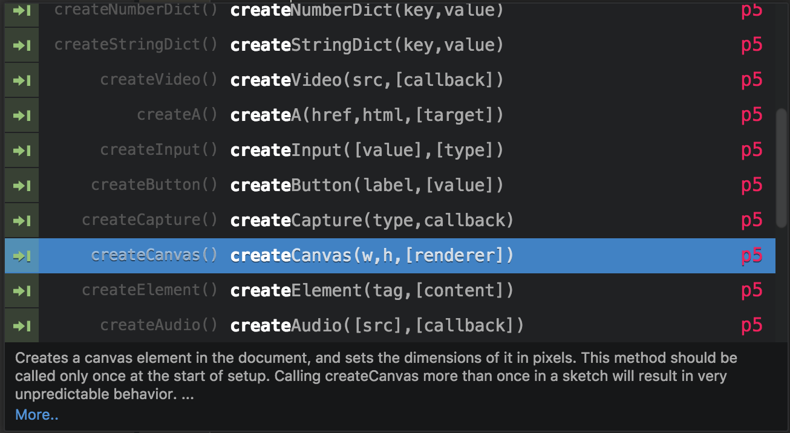

# p5js-snippets
[p5.js](http://p5.js) snippets for [atom.io](http://atom.io)

### features include:
  + auto complete
  + a short description of each p5.js function
  + a link to the p5.js reference
  + tab breakpoints at each p5.js function's arguments
  + friendly p5 logo to help you see what is a p5 function
---

p5js-snippets version should be the same as the p5.js version it is compiled for

to build the snippets from the p5.js yuidoc:
 + `cd` to `src`
 + `node build.js /path/to/p5.js`

